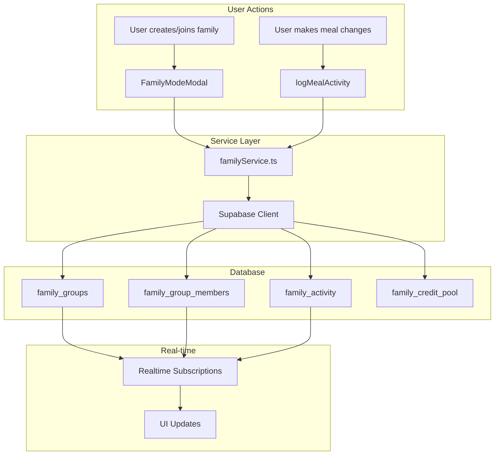

# Family Mode Architecture Documentation

## Overview

Family Mode allows multiple users to share a single meal planning workspace, pooling credits and seeing each other's changes in real-time.

---

## Database Schema

### Tables

#### `family_groups`
The main table storing family group information.

```sql
CREATE TABLE public.family_groups (
    id UUID PRIMARY KEY DEFAULT gen_random_uuid(),
    name TEXT NOT NULL,
    owner_id UUID REFERENCES auth.users(id) NOT NULL,
    invite_code TEXT UNIQUE NOT NULL,  -- Format: FAM-XXXXXX
    is_active BOOLEAN DEFAULT true,
    created_at TIMESTAMPTZ DEFAULT NOW(),
    updated_at TIMESTAMPTZ DEFAULT NOW()
);
```

#### `family_group_members`
Junction table linking users to their family group with roles.

```sql
CREATE TABLE public.family_group_members (
    id UUID PRIMARY KEY DEFAULT gen_random_uuid(),
    group_id UUID REFERENCES family_groups(id) ON DELETE CASCADE,
    user_id UUID REFERENCES auth.users(id) ON DELETE CASCADE,
    role TEXT CHECK (role IN ('owner', 'member')) DEFAULT 'member',
    is_active BOOLEAN NOT NULL DEFAULT true,  -- Set to false when leaving (preserves history)
    joined_at TIMESTAMPTZ DEFAULT NOW(),
    UNIQUE(group_id, user_id)
);

-- Enforce ONE active membership per user at DB level
CREATE UNIQUE INDEX idx_one_active_membership_per_user 
ON family_group_members (user_id) 
WHERE is_active = true;
```

> [!NOTE]
> When a user leaves a family, `is_active` is set to `false` instead of deleting the record. This preserves history and allows users to rejoin families immediately.

> [!IMPORTANT]
> The partial unique index `idx_one_active_membership_per_user` ensures a user can only have ONE active membership at any time. This prevents data inconsistency bugs.

#### `family_credit_pool`
Shared credit pool for the family group.

```sql
CREATE TABLE public.family_credit_pool (
    id UUID PRIMARY KEY DEFAULT gen_random_uuid(),
    group_id UUID REFERENCES family_groups(id) ON DELETE CASCADE UNIQUE,
    total_credits INTEGER DEFAULT 0,
    updated_at TIMESTAMPTZ DEFAULT NOW()
);
```

#### `family_activity`
Activity log tracking all member actions.

```sql
CREATE TABLE public.family_activity (
    id UUID PRIMARY KEY DEFAULT gen_random_uuid(),
    group_id UUID REFERENCES family_groups(id) ON DELETE CASCADE NOT NULL,
    user_id UUID REFERENCES auth.users(id) ON DELETE SET NULL,
    user_name TEXT,
    action_type TEXT NOT NULL,  -- 'meal_added', 'meal_edited', 'plan_generated', etc.
    target_type TEXT,           -- 'weekly_plan', 'scheduled_meal', 'grocery_list', 'member'
    target_date TEXT,           -- Date affected (e.g., '2026-01-20')
    description TEXT NOT NULL,  -- Human-readable description
    created_at TIMESTAMPTZ DEFAULT NOW()
);
```

---

## Row Level Security (RLS)

All tables have RLS enabled with policies that ensure:
- Users can only view/modify data for groups they belong to
- Group membership is verified via `family_group_members` table

### Example Policy
```sql
CREATE POLICY "Family members can view activity" ON public.family_activity
    FOR SELECT USING (
        group_id IN (
            SELECT group_id FROM family_group_members 
            WHERE user_id = auth.uid()
        )
    );
```

---

## Data Flow



---

## Key Functions

### familyService.ts

| Function | Purpose |
|----------|---------|
| `getUserFamilyGroup()` | Get current user's family group |
| `createFamilyGroup(name)` | Create new family with invite code |
| `joinFamilyGroup(inviteCode)` | Join existing family |
| `leaveFamilyGroup()` | Leave current family |
| `getFamilyMembers(groupId)` | List all members with display names |
| `logFamilyActivity(...)` | Record activity to log |
| `getFamilyActivity(groupId)` | Fetch recent activities |
| `logMealActivity(...)` | Helper for meal-related logging |

---

## Activity Types

| Type | Description |
|------|-------------|
| `member_joined` | New member joined family |
| `member_left` | Member left family |
| `meal_added` | Meal added to calendar |
| `meal_edited` | Meal modified |
| `meal_deleted` | Meal removed |
| `plan_generated` | Weekly plan generated |
| `grocery_generated` | Grocery list created |

---

## UI Components

### FamilyModeModal
Location: `components/FamilyModeModal.tsx`

Displays:
- Family name and member count
- Member list with roles (Owner/Member)
- Invite code with copy/share/regenerate
- Recent activity log (real-time updates)
- Leave family option

### Integration
- Added to AppShell.tsx profile dropdown
- Orange styling to stand out
- Modal accessible from any page
