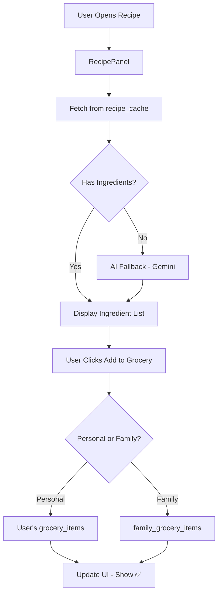

# Grocery Integration & Nutrition Feature Analysis

> Deep analysis using `/analyze` workflow - Iterative improvement cycles
> Created: 2026-01-19

---

## Phase 1: Discovery

### 1.1 Files & Components Involved

| File | Purpose |
|------|---------|
| [RecipePanel.tsx](file:///d:/Projects/Cook%20Commander/Cook-Commander/components/RecipePanel.tsx) | Recipe overlay with ingredients display |
| [GroceryList.tsx](file:///d:/Projects/Cook%20Commander/Cook-Commander/components/GroceryList.tsx) | Main grocery list component |
| [recipe-search/index.ts](file:///d:/Projects/Cook%20Commander/Cook-Commander/supabase/functions/recipe-search/index.ts) | Edge Function (YouTube + AI extraction) |
| [types.ts](file:///d:/Projects/Cook%20Commander/Cook-Commander/types.ts) | GroceryItem interface |
| [supabaseService.ts](file:///d:/Projects/Cook%20Commander/Cook-Commander/services/supabaseService.ts) | Grocery data persistence |

### 1.2 Current Data Structures

**GroceryItem (types.ts)**
```typescript
interface GroceryItem {
  category: string;    // "Vegetables", "Dairy", etc.
  item: string;        // "Paneer"
  quantity: string;    // "250g"
  checked: boolean;
}
```

**recipe_cache table (Supabase)**
| Column | Type | Description |
|--------|------|-------------|
| ingredients | jsonb | AI-generated ingredients array (strings) |
| cook_time_minutes | integer | Cooking time |
| difficulty | text | Easy/Medium/Moderate/Advanced |
| is_ai_generated | boolean | Flag for AI fallback used |

### 1.3 Data Flow Diagram



---

## Iteration 1: Initial Brainstorming

### 1.1 Grocery Integration Ideas

| # | Idea | Description | Complexity |
|---|------|-------------|------------|
| 1 | Add Single Item | Click ingredient → add to grocery | Low |
| 2 | Add All Missing | Bulk add all not-in-list items | Low |
| 3 | Smart Match | Fuzzy match "paneer" vs "cottage cheese" | Medium |
| 4 | In-Stock Indicator | Show ✅ if already in grocery list | Low |
| 5 | Quantity Scaling | Adjust for household size | Medium |
| 6 | Pantry Filter | Exclude user's pantry staples | Low |
| 7 | Category Auto-assign | AI determines Dairy/Vegetables/etc | Low |

### 1.2 Nutrition Information Ideas

| # | Idea | Description | Complexity |
|---|------|-------------|------------|
| 1 | Per-Dish Nutrition | Calories, protein, carbs, fat | Medium |
| 2 | Daily Totals | Sum of all meals for the day | Medium |
| 3 | Weekly Summary | Macro trends over the week | High |
| 4 | Health Goal Alerts | "High sodium" warnings | High |
| 5 | Visual Pie Chart | Macro breakdown visualization | Medium |
| 6 | AI Estimation | Use Gemini for nutrition data | Low (API) |

### 1.3 Issues Identified in Iteration 1

| Issue | Severity | Description |
|-------|----------|-------------|
| No grocery table integration | 🔴 HIGH | Recipe panel doesn't connect to grocery |
| Ingredients are strings only | 🟡 MED | No quantity/category parsed |
| No nutrition data in cache | 🟠 HIGH | Need to add to AI extraction |
| Family grocery handling unclear | 🟠 HIGH | Separate table or same? |

---

## Iteration 2: UX Flow Analysis

### 2.1 Current Grocery Flow (Pain Points)

```
1. User sees ingredients in RecipePanel
2. Mental note: "I need paneer"
3. Switches to Grocery tab
4. Manually types "paneer"
5. Hopes they didn't forget anything ❌
6. Returns to recipe, scrolls back ❌
```

### 2.2 Ideal Grocery Flow (Target)

```
1. User opens RecipePanel → sees ingredients
2. Each ingredient shows:
   - ✅ Already in grocery list (green)
   - ☐ Not in list (+ button)
3. User clicks [Add All Missing]
4. Toast: "3 items added to grocery"
5. Items appear in Grocery tab immediately
6. When cooking: "Grocery Complete ✓"
```

### 2.3 Desktop vs Mobile UX

| Aspect | Desktop | Mobile |
|--------|---------|--------|
| Ingredient list layout | 2-column grid | Single column (compact) |
| Add button | Text button with icon | Icon only (space efficient) |
| Add All button | Full width at bottom | Sticky footer |
| In-list indicator | "✅ In Grocery" badge | ✅ icon only |
| Nutrition display | Side panel / accordion | Accordion or tab |

### 2.4 Personal vs Family Mode

| Aspect | Personal | Family |
|--------|----------|--------|
| Grocery list source | `grocery_list_history` | `family_grocery_items` (new?) |
| Who sees additions | User only | All family members |
| Notification | None needed | Optional: "Dad added 3 items" |
| Conflict handling | N/A | Last-write-wins or merge |

---

## Iteration 3: Backend Architecture

### 3.1 Database Schema Updates

**Option A: Unified Table with Context**
```sql
CREATE TABLE grocery_items (
  id uuid PRIMARY KEY DEFAULT gen_random_uuid(),
  user_id uuid REFERENCES auth.users,
  family_group_id uuid REFERENCES family_groups,
  item text NOT NULL,
  quantity text,
  category text,
  checked boolean DEFAULT false,
  source text,  -- 'manual' | 'recipe' | 'ai_generated'
  source_recipe text,  -- meal name if from recipe
  created_at timestamptz DEFAULT now(),
  
  -- Either user_id OR family_group_id should be set
  CONSTRAINT check_ownership CHECK (
    (user_id IS NOT NULL AND family_group_id IS NULL) OR
    (user_id IS NULL AND family_group_id IS NOT NULL)
  )
);
```

**Option B: Separate Tables (Cleaner RLS)**
```sql
-- Personal grocery items
CREATE TABLE personal_grocery_items (...);

-- Family grocery items  
CREATE TABLE family_grocery_items (...);
```

**Recommendation**: Option A with proper RLS policies - simpler to maintain.

### 3.2 Recipe Cache Enhancement for Nutrition

```sql
ALTER TABLE recipe_cache ADD COLUMN nutrition jsonb;

-- Example nutrition data structure:
{
  "calories": 450,
  "protein": 18,
  "carbs": 35,
  "fat": 25,
  "fiber": 4,
  "sodium": 800,
  "per_serving": true,
  "servings": 4,
  "is_estimate": true
}
```

### 3.3 AI Prompt Enhancement

Current prompt extracts: `cookTimeMinutes`, `difficulty`, `ingredients[]`

Enhanced prompt should also extract:
```json
{
  "ingredients": [
    {"name": "paneer", "quantity": "250g", "category": "dairy"},
    {"name": "tomatoes", "quantity": "4 medium", "category": "vegetables"}
  ],
  "nutrition": {
    "calories": 450,
    "protein": 18,
    "carbs": 35,
    "fat": 25
  }
}
```

---

## Iteration 4: Detailed Component Design

### 4.1 RecipePanel Ingredient Section (Desktop)

```
┌─────────────────────────────────────────────────────┐
│ 🥕 INGREDIENTS                              (8 items)│
├─────────────────────────────────────────────────────┤
│ ☐ 250g Paneer                            [+ Cart]   │
│ ✅ 4 Tomatoes                            In Grocery  │
│ ☐ 1 cup Cream                            [+ Cart]   │
│ ☐ 2 tbsp Butter                          [+ Cart]   │
│ ─ Salt (pantry staple)                   Skipped    │
│ ─ Garam Masala (pantry)                  Skipped    │
│ ☐ Fresh Coriander                        [+ Cart]   │
│ ☐ Kasuri Methi                           [+ Cart]   │
├─────────────────────────────────────────────────────┤
│ [➕ Add 5 Missing Items to Grocery]                 │
│                                                     │
│ 🍽️ NUTRITION (per serving)         [ℹ️ AI Estimate] │
│ ┌─────────┬─────────┬─────────┬─────────┐          │
│ │  450    │   18g   │   35g   │   25g   │          │
│ │  kcal   │ protein │  carbs  │   fat   │          │
│ └─────────┴─────────┴─────────┴─────────┘          │
└─────────────────────────────────────────────────────┘
```

### 4.2 RecipePanel Ingredient Section (Mobile)

```
┌────────────────────────────────────┐
│ 🥕 INGREDIENTS (8)                 │
├────────────────────────────────────┤
│ ☐ 250g Paneer               [+]   │
│ ✅ 4 Tomatoes                      │
│ ☐ 1 cup Cream               [+]   │
│ ☐ 2 tbsp Butter             [+]   │
│ ─ Salt (pantry)                    │
│ ...                                │
├────────────────────────────────────┤
│ [  ➕ Add 5 to Grocery  ]          │
├────────────────────────────────────┤
│ 🍽️ NUTRITION  450 | 18g | 35g | 25g │
│                cal  pro  carb  fat  │
└────────────────────────────────────┘
```

### 4.3 Family Mode Visibility

When in **Family Mode**:
- Check against family's grocery list
- Add to shared family grocery list
- Show badge: "Adding to Family Grocery 👨‍👩‍👧"

When in **Personal Mode**:
- Check against user's personal grocery list
- Add to personal list only
- No special badge needed

---

## Iteration 5: Technical Implementation Plan

### 5.1 Frontend Changes

**RecipePanel.tsx modifications:**
```typescript
// New state
const [groceryItems, setGroceryItems] = useState<GroceryItem[]>([]);
const [loadingGrocery, setLoadingGrocery] = useState(false);

// New function: Check which ingredients are already in grocery
const checkGroceryStatus = async (ingredients: string[]) => {
  const { isFamilyModeActive, familyGroup } = useFamily();
  // Fetch current grocery list based on mode
  // Compare with fuzzy matching
  // Return: { item: string, inGrocery: boolean }[]
};

// New function: Add ingredient to grocery
const addToGrocery = async (ingredient: ParsedIngredient) => {
  const { isFamilyModeActive, familyGroup } = useFamily();
  // Insert to appropriate table/context
  // Update local state
  // Show toast
};

// New UI section in render
<IngredientsSection 
  ingredients={recipeData.ingredients}
  groceryStatus={groceryStatus}
  onAddItem={addToGrocery}
  onAddAll={addAllMissing}
  isPantryItem={checkPantryStaple}
  isFamilyMode={isFamilyModeActive}
/>
```

### 5.2 Backend API / Edge Function

**New endpoint or extend recipe-search:**
```typescript
// POST /functions/v1/grocery-add
{
  "items": [
    {"name": "Paneer", "quantity": "250g", "category": "Dairy"}
  ],
  "user_id": "...",
  "family_group_id": "..." | null,
  "source_recipe": "Paneer Butter Masala"
}
```

### 5.3 AI Prompt Update

```typescript
const enhancedPrompt = `
For the dish "${dishName}", provide:
1. Cooking time in minutes
2. Difficulty level (Easy/Medium/Moderate/Advanced)
3. Ingredient list with quantities and categories
4. Estimated nutrition per serving

Return JSON:
{
  "cookTimeMinutes": number,
  "difficulty": "Easy" | "Medium" | "Moderate" | "Advanced",
  "ingredients": [
    {"name": "paneer", "quantity": "250g", "category": "dairy"}
  ],
  "nutrition": {
    "calories": number,
    "protein": number (grams),
    "carbs": number (grams),
    "fat": number (grams)
  }
}
`;
```

---

## Iteration 6: Edge Cases & Error Handling

### 6.1 Edge Cases

| Case | Handling |
|------|----------|
| Empty ingredients list | Show "No ingredients found" message |
| AI fails to extract nutrition | Show "Nutrition data unavailable" |
| User not logged in | Disable add buttons, show login prompt |
| Duplicate item in grocery | Don't add again, show "Already added" |
| Ingredient in pantry staples | Gray out, show "In your pantry" |
| Family member already added | Show "Added by [Name]" timestamp |
| Very long ingredient list | Collapse after 6 items, "Show more" |

### 6.2 Loading States

| State | UI |
|-------|-----|
| Fetching grocery status | Skeleton loaders on each row |
| Adding single item | Button shows spinner → ✅ |
| Adding all items | Modal with progress bar |
| AI generating nutrition | Pulsing skeleton in nutrition row |

### 6.3 Error States

| Error | Message | Action |
|-------|---------|--------|
| Failed to add item | "Couldn't add [item]. Try again?" | Retry button |
| No grocery list exists | Auto-create empty list | Silent |
| Nutrition API failed | "Nutrition data unavailable" | Show anyway |

---

## Iteration 7: Performance Optimizations

### 7.1 Caching Strategy

| Data | Cache Duration | Location |
|------|----------------|----------|
| Recipe ingredients | 7 days | Supabase recipe_cache |
| Nutrition data | 7 days | Same row in recipe_cache |
| Current grocery list | Session | React state + context |
| Pantry staples | Profile load | UserPreferences |

### 7.2 Query Optimization

```sql
-- Create index for fuzzy matching
CREATE INDEX idx_grocery_item_lower ON grocery_items (lower(item));

-- Optimize ingredient lookup
CREATE INDEX idx_recipe_cache_meal ON recipe_cache (meal_name_lower);
```

### 7.3 Bundle Considerations

- Nutrition pie chart: Use simple CSS (no chart library)
- Fuzzy matching: Use lightweight `fuse.js` (~5KB gzipped)
- No new major dependencies needed

---

## Iteration 8: Security & RLS Policies

### 8.1 Row Level Security for grocery_items

```sql
-- Users can read/write their own items
CREATE POLICY "user_grocery_items" ON grocery_items
  FOR ALL USING (
    auth.uid() = user_id 
    OR family_group_id IN (
      SELECT group_id FROM family_group_members 
      WHERE user_id = auth.uid() AND is_active = true
    )
  );

-- Insert policy for family items
CREATE POLICY "insert_family_grocery" ON grocery_items
  FOR INSERT WITH CHECK (
    (user_id = auth.uid()) OR
    (family_group_id IN (
      SELECT group_id FROM family_group_members 
      WHERE user_id = auth.uid() AND is_active = true
    ))
  );
```

---

## Iteration 9: Testing Strategy

### 9.1 Unit Tests

| Test Case | Expected |
|-----------|----------|
| `parseIngredient("250g paneer")` | `{name: "paneer", qty: "250g"}` |
| `isPantryStaple("salt", pantry)` | `true` |
| `fuzzyMatch("paneer", "cottage cheese")` | `true` (or configurable) |
| `calculateNutrition(ingredients)` | Aggregated values |

### 9.2 Integration Tests

| Flow | Steps |
|------|-------|
| Add single ingredient | Open recipe → Click + → Verify in grocery |
| Add all missing | Open recipe → Click Add All → Count matches |
| Family sync | User A adds → User B sees item |
| Pantry exclusion | Configure pantry → Items grayed out |

### 9.3 E2E Browser Tests

```typescript
test('grocery integration from recipe panel', async () => {
  await page.click('[data-testid="meal-recipe-button"]');
  await page.waitForSelector('[data-testid="ingredient-list"]');
  await page.click('[data-testid="add-all-grocery"]');
  await page.waitForSelector('[data-testid="success-toast"]');
  // Navigate to grocery tab
  // Verify items appear
});
```

---

## Iteration 10: Implementation Roadmap

### Phase A: Grocery Integration (Priority)

| Step | Task | Effort | Dependencies |
|------|------|--------|--------------|
| A1 | Create `grocery_items` table with RLS | 1 hr | None |
| A2 | Update AI prompt for structured ingredients | 1 hr | A1 |
| A3 | Add `checkGroceryStatus` function | 2 hr | A1 |
| A4 | Build ingredient list UI with status | 3 hr | A2, A3 |
| A5 | Implement `addToGrocery` function | 2 hr | A1 |
| A6 | Add "Add All Missing" button | 1 hr | A5 |
| A7 | Handle pantry staple filtering | 1 hr | A4 |
| A8 | Family mode integration | 2 hr | A5 |
| A9 | Testing & polish | 2 hr | All |

**Total Grocery: ~15 hours**

### Phase B: Nutrition Information

| Step | Task | Effort | Dependencies |
|------|------|--------|--------------|
| B1 | Add `nutrition` column to recipe_cache | 30 min | None |
| B2 | Update AI prompt for nutrition extraction | 1 hr | B1 |
| B3 | Build nutrition display UI (pill badges) | 2 hr | B2 |
| B4 | Add "AI Estimate" disclaimer | 30 min | B3 |
| B5 | Mobile-responsive layout | 1 hr | B3 |
| B6 | Cache nutrition in database | 1 hr | B2 |

**Total Nutrition: ~6 hours**

---

## Summary: Final Design Decisions

### Grocery Integration
✅ **Unified `grocery_items` table** with user_id / family_group_id  
✅ **Structured ingredients** from AI: `{name, quantity, category}`  
✅ **Fuzzy matching** to detect "already in grocery"  
✅ **Pantry staple filtering** from user preferences  
✅ **Real-time sync** for family mode  
✅ **"Add All Missing"** bulk action  

### Nutrition Information
✅ **AI-generated estimates** via Gemini  
✅ **Cache in recipe_cache.nutrition** (jsonb)  
✅ **Simple 4-pill layout**: Calories, Protein, Carbs, Fat  
✅ **Clear "AI Estimate"** disclaimer  
✅ **No external API** - cost-effective  

### Desktop vs Mobile
- **Desktop**: 2-column ingredient grid, side nutrition panel
- **Mobile**: Single column, accordion nutrition, sticky "Add All" button

### Personal vs Family
- **Personal**: Uses user's own grocery list
- **Family**: Uses shared family grocery list, shows who added items
