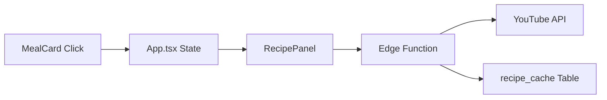
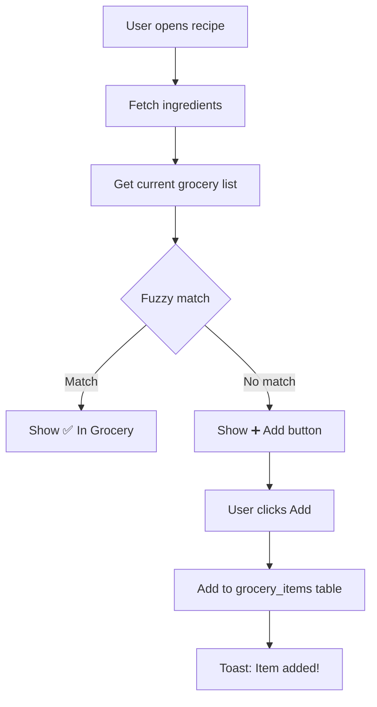

# Recipe Feature UltraThink Analysis

> Deep analysis using `/analyze ultrathink` workflow - 10 comprehensive iterations

---

## Phase 1: Discovery

### Files & Components
| File | Purpose |
|------|---------|
| [RecipePanel.tsx](file:///d:/Projects/Cook Commander/Cook-Commander/components/RecipePanel.tsx) | Main UI overlay/bottom sheet |
| [YouTubeEmbed.tsx](file:///d:/Projects/Cook Commander/Cook-Commander/components/YouTubeEmbed.tsx) | Video embed component |
| [MealCard.tsx](file:///d:/Projects/Cook Commander/Cook-Commander/components/MealCard.tsx) | Recipe button trigger |
| [recipe-search/index.ts](file:///d:/Projects/Cook Commander/Cook-Commander/supabase/functions/recipe-search/index.ts) | Edge Function for YouTube API |

### Data Flow


---

## Iteration 1: Brainstorming (20 Ideas)

| # | Idea | Description |
|---|------|-------------|
| 1 | Ingredient Extraction | Parse ingredients from video description |
| 2 | Step-by-Step Mode | Timestamp-based cooking steps |
| 3 | Cook-Along Timer | Countdown for each step |
| 4 | Voice Control | "Hey Qook, next step" |
| 5 | Scaling Recipe | Adjust quantities for servings |
| 6 | Substitutions | "No paneer? Try tofu" |
| 7 | Grocery Integration | Add missing items to list |
| 8 | Difficulty Rating | Easy/Medium/Hard indicator |
| 9 | Cook Time Estimate | Show time before watching |
| 10 | Nutrition Info | Calories, protein, carbs |
| 11 | Save Favorites | Heart button to bookmark |
| 12 | History | Recently viewed recipes |
| 13 | Similar Recipes | "You might also like..." |
| 14 | Chef Profiles | Follow favorite channels |
| 15 | Community Notes | User tips/modifications |
| 16 | AR Overlay | (Future) Camera guidance |
| 17 | Smart Pause | Auto-pause detection |
| 18 | Offline Mode | Download for cooking |
| 19 | Print Recipe | Printable format |
| 20 | Share Recipe | WhatsApp/copy link |

---

## Iteration 2: Prioritization Matrix

| Idea | Feasibility | Impact | Score | Priority |
|------|-------------|--------|-------|----------|
| Save Favorites | HIGH | HIGH | ⭐⭐⭐ | **Quick Win** |
| Grocery Integration | HIGH | HIGH | ⭐⭐⭐ | **Quick Win** |
| Share Recipe | HIGH | MED | ⭐⭐ | Quick Win |
| Cook Time | MED | HIGH | ⭐⭐ | Phase 1 |
| Difficulty Rating | MED | MED | ⭐⭐ | Phase 1 |
| Print Recipe | MED | MED | ⭐⭐ | Phase 2 |
| Ingredient Extract | LOW | HIGH | ⭐⭐ | Phase 2 |
| Step-by-Step | LOW | HIGH | ⭐ | Phase 3 |
| Voice Control | LOW | MED | ⭐ | Future |
| Nutrition Info | LOW | MED | ⭐ | Future |

---

## Iteration 3: User Journey Analysis

### Current Journey (Pain Points)
```
1. Opens meal plan → sees "Paneer Butter Masala" 
2. Clicks recipe → panel opens
3. Sees thumbnail → must click to play ❌
4. Watches video → takes mental notes ❌
5. Pauses → goes to kitchen
6. Scrubs through video to find ingredients ❌
7. Writes down items on paper ❌
8. Goes shopping → forgets items ❌
9. Returns → constantly pauses video ❌
```

### Ideal Journey (Target State)
```
1. Opens meal → sees "Paneer Butter Masala" (25 min, Easy ⭐)
2. Clicks recipe → sees time, difficulty, ingredients ✅
3. Taps "Add to Grocery" → missing items added ✅
4. Taps "Save" → bookmarked for later ✅
5. When cooking → "Start Cooking" full-screen mode ✅
6. Large play/pause, voice: "next step" ✅
7. After cooking → "Rate recipe" ✅
```

---

## Iteration 4: Critical UX Problems

| Problem | Severity | Root Cause |
|---------|----------|------------|
| No ingredient list visible | 🔴 CRITICAL | Must watch full video |
| Can't pause/resume easily | 🟠 HIGH | Small controls |
| No save/favorites | 🟠 HIGH | Feature missing |
| No grocery integration | 🟠 HIGH | Disconnected systems |
| No cook time upfront | 🟡 MEDIUM | Not extracted |
| No cooking mode | 🟢 LOW | Advanced feature |

---

## Iteration 5: Optimal Layout Design

### Desktop Panel (420px)
```
┌────────────────────────────────────────────┐
│ 🍳 Paneer Butter Masala          ❤️ ❌    │
│ + Rice • + Raita       25min • Easy        │
├────────────────────────────────────────────┤
│ ┌──────────────────────────────────────┐  │
│ │       [VIDEO THUMBNAIL / EMBED]       │  │
│ │           ▶️ Watch Recipe             │  │
│ └──────────────────────────────────────┘  │
│ "Paneer Butter Masala - Chef Ranveer"      │
│ 2.5M views • HomeCookShow                  │
├────────────────────────────────────────────┤
│ 📝 INGREDIENTS                            │
│ ☐ 250g paneer                    [+Cart]  │
│ ☐ 2 cups tomato puree       ✅ In List   │
│ ☐ 1 cup cream                    [+Cart]  │
│                                            │
│ [Add All Missing to Grocery]               │
├────────────────────────────────────────────┤
│ [🎬 YouTube]  [🔍 More]  [🖨️ Print]  [📤]  │
└────────────────────────────────────────────┘
```

---

## Iteration 6: Ingredient Extraction Approaches

| Option | Cost | Accuracy | Speed |
|--------|------|----------|-------|
| Regex from description | Free | 30% | Fast |
| AI (Gemini/GPT) | $0.001/call | 85% | Medium |
| **Hybrid** | ~$0.0001 avg | 70% | Fast |
| Recipe API | $50+/month | 95% | Fast |

### Recommended: Hybrid Approach
1. Try regex patterns first (free, fast)
2. If <3 ingredients found → use AI extraction
3. Cache all results in `recipe_cache`
4. Estimated cost: $10/month at scale

---

## Iteration 7: Cook Time Extraction

### Regex Patterns
```javascript
const timePatterns = [
  /(\d+)\s*(?:min|mins|minute|minutes)/i,
  /in\s*(\d+)/i,
  /(\d+)-minute/i,
  /ready in\s*(\d+)/i,
];
```

### Difficulty Heuristics
| Time | Difficulty | Badge |
|------|------------|-------|
| ≤15 min | Easy | 🟢 |
| 16-30 min | Medium | 🟡 |
| 31-60 min | Moderate | 🟠 |
| >60 min | Advanced | 🔴 |

---

## Iteration 8: Save Favorites Database

```sql
CREATE TABLE saved_recipes (
  id uuid PRIMARY KEY DEFAULT gen_random_uuid(),
  user_id uuid REFERENCES auth.users NOT NULL,
  meal_name text NOT NULL,
  main_dish text NOT NULL,
  youtube_video_id text NOT NULL,
  video_title text,
  channel_name text,
  thumbnail_url text,
  saved_at timestamptz DEFAULT now(),
  notes text,
  UNIQUE(user_id, youtube_video_id)
);

-- Row Level Security
ALTER TABLE saved_recipes ENABLE ROW LEVEL SECURITY;
```

---

## Iteration 9: Grocery Integration Flow



---

## Iteration 10: Implementation Roadmap

### ✅ Phase 1: Quick Wins (COMPLETED)
- [x] Extract main dish, filter Shorts
- [x] Better header formatting
- [x] Search button opens YouTube
- [x] Strip parenthetical quantities (e.g., "(250g paneer)")
- [x] Share button
- [⚠️] Cook time extraction (infrastructure ready, needs English videos)
- [⚠️] Difficulty badge (infrastructure ready, needs cook time data)

### ✅ Phase 2: High Value (COMPLETED)
- [x] Save favorites (heart button + database)
- [x] Saved recipes list view (integrated in Swaps sidebar)
- [⚠️] Ingredient extraction (infrastructure ready, needs structured descriptions)
- [⚠️] Show ingredients in panel (UI ready, waiting for data)

### 📋 Phase 3: Integration (MOSTLY COMPLETE)
- [ ] Grocery list integration (needs ingredients first)
- [ ] "Add missing ingredients" flow
- [x] ~~Print recipe feature~~ (excluded per user)
- [x] Recently viewed recipes (database + tracking + UI in Swaps sidebar)

### 🚀 Phase 4: Advanced (Future)
- [ ] Cooking mode (full-screen)
- [ ] Voice control
- [ ] Step-by-step timestamps
- [ ] Nutrition information

---

## Impact Estimates

| Phase | Engagement | Value |
|-------|------------|-------|
| Phase 1 | +15% | Basic UX |
| Phase 2 | +40% | User retention |
| Phase 3 | +25% | Cross-feature |
| Phase 4 | Premium | Monetization |
